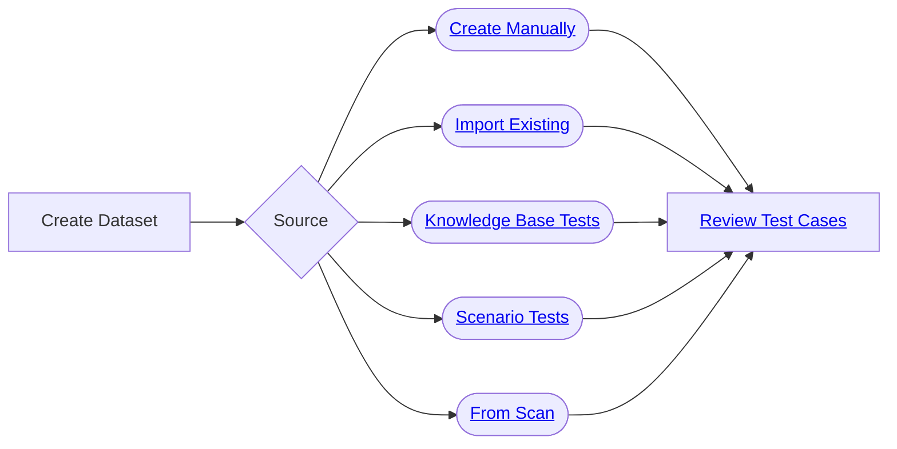

import { CardGrid, LinkCard } from "@astrojs/starlight/components";

A **dataset** is a collection of conversations used to evaluate your agents. We allow manual test creation for fine-grained control,
but since generative AI agents can encounter an infinite number of test cases, automated test case generation is often necessary, especially when you don't have any test conversations to import.

In this section, we will walk you through how to create test cases and datasets using the Hub interface. In general, we cover four different ways to create datasets:

<CardGrid>
  <LinkCard
    title="Create manual tests"
    description="Design your own test cases using a full control over the test case creation process and explore them in the playground."
    href="/hub/ui/datasets/manual"
  />
  <LinkCard
    title="Import tests"
    description="Import existing test datasets from a JSONL or CSV file, obtained from another tool, like Giskard Open Source."
    href="/hub/ui/datasets/import"
  />
  <LinkCard
    title="Generate scenario tests"
    description="Create targeted, business-specific tests using scenario-based dataset generation. Test your agents with specific personas and business rules without editing your agent's core functionality."
    href="/hub/ui/datasets/scenario"
  />
  <LinkCard
    title="Generate knowledge base tests"
    description="Detect business failures, by generating synthetic test cases to detect business failures, like hallucinations or denial to answer questions, using document-based queries and knowledge bases."
    href="/hub/ui/datasets/knowledge-base"
  />
</CardGrid>

## High-level workflow

:::tip
For advanced automated discovery of weaknesses such as prompt injection or hallucinations, check out our [Vulnerability Scanner](/hub/ui/scan), which uses automated agents to generate tests for common security and robustness issues.
:::
