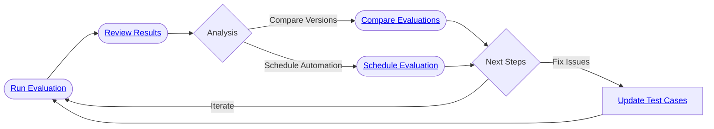

import { CardGrid, LinkCard } from "@astrojs/starlight/components";

Evaluations are the core of the testing process in Giskard Hub. They allow you to run your test datasets against your agents and evaluate their performance using the checks that you have defined.

The Giskard Hub provides a comprehensive evaluation system that supports:

* **Local evaluations**: Run evaluations locally using development agents
* **Remote evaluations**: Run evaluations in the Hub using deployed agents
* **Scheduled evaluations**: Automatically run evaluations at specified intervals

In this section, we will walk you through how to run and manage evaluations using the Hub interface.

:::tip[When to execute your tests?]
Depending on your AI lifecycle, you may have different reasons to execute your tests:

- **Development time:** Compare agent versions during development and identify the right correction strategies for developers.
- **Deployment time:** Perform non-regression testing in the CI/CD pipeline for DevOps.
- **Production time:** Provide high-level reporting for business executives to stay informed about key vulnerabilities in a running agent.
:::

In this section, we will walk you through how to manage evaluations in Giskard Hub.

<CardGrid>
  <LinkCard title="Run evaluations" href="/hub/ui/evaluations/create" description="Create evaluations" />
  <LinkCard title="Schedule evaluations" href="/hub/ui/evaluations/schedule" description="Schedule evaluations to run automatically." />
  <LinkCard title="Compare evaluations" href="/hub/ui/evaluations/compare" description="Compare evaluations to see if there are any regressions." />
</CardGrid>

## High-level workflow

:::tip
Local evaluations are supported via the SDK. To run evaluations against local development agents, see [Local evaluations](/hub/sdk/evaluations/local).
:::
