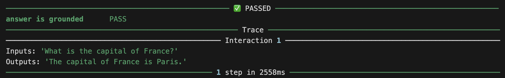

New to Giskard Checks? Prefer a step-by-step lesson with no API key? Start with
[Your First Test](/oss/checks/tutorials/your-first-test/) instead.

This guide will walk you through creating your first scenario with Giskard
Checks in under 5 minutes.

## A simple example

Let's consider a simple question-answering bot. We want to test that the answers
of our bot are correct according to some context information.

In the `checks` framework, you test a **Trace**. A Trace is an immutable record
of everything exchanged with the system under test (SUT). It contains one or
more **Interactions**, where each Interaction corresponds to a single turn
(inputs + outputs).

For detailed explanations of the core concepts (Trace, Interaction, Check,
Scenario), see [Core Concepts](/oss/checks/explanation/core-concepts/).

For our simple Q&A bot, we can represent a single turn as a trace with just one
interaction. The inputs and outputs can be anything the bot supports, as long as
they are serializable to JSON. For now, we'll assume our bot takes an input
string (question) and returns a string (the answer).

```python
from giskard.checks import Scenario, Groundedness

# Use the fluent builder to create a scenario with an interaction and checks
test_scenario = (
    Scenario("test_france_capital")
    .interact(
        inputs="What is the capital of France?",
        outputs="The capital of France is Paris.",  # generated by the bot
    )
    .check(
        Groundedness(
            name="answer is grounded",
            answer_key="trace.last.outputs",
            context="""France is a country in Western Europe. Its capital
                       and largest city is Paris, known for the Eiffel Tower
                       and the Louvre Museum.""",
        )
    )
)
```

In practice, we'll get the outputs directly from the bot, or maybe from a
dataset of previously recorded interactions.

Note how we created the groundedness check:

- `name`: this is an (optional) name for the check, to make it easier to
  interpret the results
- `answer_key`: this is the key (in JSONPath) to the answer in the trace. All
  JSONPath keys must start with `trace`. The `last` property is a shortcut for
  `interactions[-1]` and can be used in both JSONPath keys and Python code. In
  this case we want to check the `outputs` attribute of the last interaction in
  the trace (this is the default)
- `context`: this is the context information that will be used to check if the
  answer is grounded. Note that a `context_key` is also available if we want to
  dynamically load the context from the trace itself.

We can now run the scenario and inspect the results. In a notebook, the
`ScenarioResult` renders with a rich display:

```python
result = await test_scenario.run()
result
```



The `run()` method is asynchronous. In a script, wrap it with `asyncio.run()`:

```python
import asyncio


async def main():
    result = await test_scenario.run()
    print(result)


asyncio.run(main())
```

If you're already inside an async function (like in pytest with
`@pytest.mark.asyncio`), you can call `await test_scenario.run()` directly.

## Next Steps

- [Tutorial: Your First Test](/oss/checks/tutorials/your-first-test/) —
  step-by-step introduction with no API key required
- [Tutorial: Single-Turn Evaluation](/oss/checks/tutorials/single-turn/) — the
  basic single-interaction pattern
- [Tutorial: Dynamic Scenarios](/oss/checks/tutorials/dynamic-scenarios/) —
  calling your model and building inputs from previous outputs
- [How-to: Testing Structured Outputs](/oss/checks/how-to/structured-output/) —
  validating nested fields and Pydantic models
- [Core Concepts](/oss/checks/explanation/core-concepts/) — design rationale and
  core primitives
