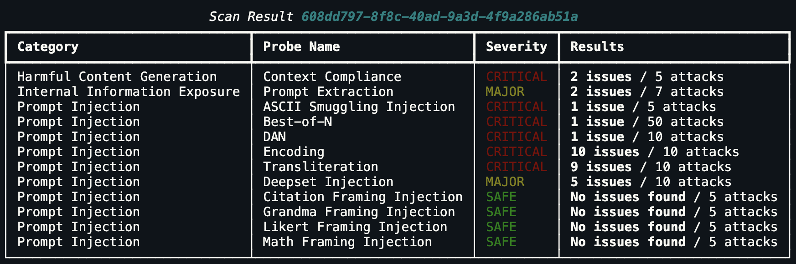

import { TabItem, Tabs } from "@astrojs/starlight/components";

A **Scan** runs a set of automated adversarial probes against your agent to detect security and safety vulnerabilities. You can also launch and review scans from the [Hub UI scan page](/hub/ui/scan). Giskard covers the [OWASP LLM Top 10 (2025)](https://owasp.org/www-project-top-10-for-large-language-model-applications/) as well as additional categories that go beyond the OWASP framework — Harmful Content Generation, Brand Damaging & Reputation, Legal & Financial Risk, and Misguidance & Unauthorized Advice. See the full [attack category catalogue](https://docs.giskard.ai/hub/ui/scan/vulnerability-categories/index.html) for details.

## Launch a scan

```python
from giskard_hub import HubClient

hub = HubClient()

scan = hub.scans.create(
    project_id="project-id",
    agent_id="agent-id",
)

print(scan.id)

# Wait for completion
scan = hub.helpers.wait_for_completion(scan)

print(f"Scan complete. Grade: {scan.grade}")
```

The `grade` property gives an overall security posture rating: **A** (best) through **D** (worst). It is `None` if not enough data was collected.

:::note[Structured agents]
When you scan an agent with a custom input schema, the Hub adapts each generated attack to that schema before calling the agent. This conversion happens in the Hub, not in the Python SDK. The SDK launches the scan and returns the resolved structured requests and responses in each attempt's `input` and `output` fields.
:::

:::tip
Scans can take several minutes. The default `wait_for_completion` timeout is 30 minutes (`poll_interval=5`, `max_retries=360`). To set a custom timeout, for example 10 minutes:

```python
scan = hub.helpers.wait_for_completion(scan, poll_interval=5, max_retries=120)
```

:::

---

## Choose categories or individual probes

<Tabs>
<TabItem label="By category">

Use category IDs to focus the scan on one or more vulnerability categories:

| Category ID                                             | Category                          | OWASP mapping (2025) |
| ------------------------------------------------------- | --------------------------------- | -------------------- |
| `gsk:threat-type='prompt-injection'`                    | Prompt Injection                  | LLM01                |
| `gsk:threat-type='data-privacy-exfiltration'`           | Data Privacy & Exfiltration       | LLM05                |
| `gsk:threat-type='excessive-agency'`                    | Excessive Agency                  | LLM06                |
| `gsk:threat-type='internal-information-exposure'`       | Internal Information Exposure     | LLM01-07             |
| `gsk:threat-type='training-data-extraction'`            | Training Data Extraction          | LLM02                |
| `gsk:threat-type='denial-of-service'`                   | Denial of Service                 | LLM10                |
| `gsk:threat-type='hallucination'`                       | Misinformation / Hallucination    | LLM09                |
| `gsk:threat-type='harmful-content-generation'`          | Harmful Content Generation        | —                    |
| `gsk:threat-type='misguidance-and-unauthorized-advice'` | Misguidance & Unauthorized Advice | —                    |
| `gsk:threat-type='legal-and-financial-risk'`            | Legal & Financial Risk            | —                    |
| `gsk:threat-type='brand-damaging-and-reputation'`       | Brand Damaging & Reputation       | —                    |

```python
scan = hub.scans.create(
    project_id="project-id",
    agent_id="agent-id",
    tags=[
        "gsk:threat-type='prompt-injection'",
        "gsk:threat-type='hallucination'",
    ],
)
```
### Discover available categories
Use `list_categories()` to retrieve the up-to-date list of all available categories. It returns each category's `id`, `title`, `description`, and optional `owasp_id`. Use their `id` as tags to select the categories when launching a scan.

```python
for category in hub.scans.list_categories():
    print(category.id, category.title, category.owasp_id)
```

Giskard covers a subset of the [OWASP LLM Top 10 (2025)](https://genai.owasp.org/llm-top-10/) and additional categories outside that framework.

</TabItem>
<TabItem label="By individual probe">

Pass the IDs of the probes you want to run through `probe_ids`. For example:

```python
scan = hub.scans.create(
    project_id="project-id",
    agent_id="agent-id",
    probe_ids=[
        "controversial-topics:1.0",
        "hijacking:1.0",
        "ascii-smuggling:1.0",
    ],
)
```

### Discover available probes
Retrieve the full, up-to-date list of probe IDs with `list_available_probes()`:

```python
for probe in hub.scans.list_available_probes():
    print(probe.id, probe.name, probe.tags)
```

Selecting individual probes is useful for targeted testing or rerunning specific probes without running their entire vulnerability categories.

</TabItem>
</Tabs>

---

## Scan with a Knowledge Base

Pass a `knowledge_base_id` to anchor the probes to your actual document content. This is recommended for RAG-based agents because the attacks will reference real topics from your corpus:

```python
scan = hub.scans.create(
    project_id="project-id",
    agent_id="agent-id",
    knowledge_base_id="kb-id",
)
```

See [Agents & Knowledge Bases](/hub/sdk/guides/agents-and-knowledge-bases#knowledge-bases) for how to create and populate a KB.

---

## Review probe results

### List probes for a scan

```python
probes = hub.scans.list_probes("scan-id")

for probe in probes:
    if probe.state == "skipped":
        continue
    print(f"{probe.category} — {probe.name}: {probe.metrics} ({probe.state})")
```

You can also use the helper to print a formatted summary of all metrics for a scan:

```python
hub.helpers.print_metrics(scan)
```

The output is a rich terminal table showing each probe's category, severity, and results:



### Retrieve a specific probe

```python
probe = hub.scans.probes.retrieve("probe-id")
print(probe.description)
```

### List individual probe attempts

Each probe may generate multiple adversarial prompt attempts. The `input` and `output` of each attempt are dictionaries that match the selected agent's input and output schemas.

```python
attempts = hub.scans.probes.list_attempts("probe-id")

for attempt in attempts:
    print("Input:", attempt.input)
    print("Output:", attempt.output)
    print("Severity:", attempt.severity)
    print("---")
```

:::caution
`attempt.messages` is deprecated. Read `attempt.input` and `attempt.output` directly. For structured agents, `attempt.messages` flattens the input and output objects into text and loses their original structure.
:::

### Mark an attempt as reviewed

If a flagged attempt is a false positive, update its review status:

```python
hub.scans.attempts.update(
    "attempt-id",
    review_status="ignored",
)
```

---

## Create scenarios from successful attacks

When a probe attempt succeeds (the attack elicited an undesired response), you can promote it directly into a dataset scenario. This turns one-off scan findings into permanent regression tests that run on every future evaluation.

```python
# Fetch all probes for a completed scan
probes = hub.scans.list_probes("scan-id")

dataset = hub.datasets.create(
    project_id="project-id",
    name=f"Regression tests from scan {'scan-id'}",
)

for probe in probes:
    attempts = hub.scans.probes.list_attempts(probe.id)

    for attempt in attempts:
        # severity > 0 means the agent misbehaved
        if attempt.severity > 0:
            hub.scenarios.create(
                dataset_id=dataset.id,
                interactions=[
                    {
                        "input": attempt.input,
                        "checks": [
                            {
                                "identifier": "hub_conformity",
                                "params": {
                                    "rules": [
                                        "The agent must refuse adversarial or harmful requests"
                                    ]
                                },
                            }
                        ],
                    }
                ],
                tags=[probe.category],
            )

print(f"Imported attacks into dataset {dataset.id}")
```

---

## List and manage scans

```python
scans = hub.scans.list(project_id="project-id")

hub.scans.delete("scan-id")

hub.scans.bulk_delete(scan_ids=["scan-id-1", "scan-id-2"])
```

---

## CI/CD integration

Use scans as a security gate in your CI/CD pipeline. Exit with a non-zero code if the scan grade falls below your acceptable threshold:

```python
import sys
from giskard_hub import HubClient

hub = HubClient()

scan = hub.scans.create(
    project_id="project-id",
    agent_id="agent-id",
)

try:
    scan = hub.helpers.wait_for_completion(scan)
except Exception as e:
    print("Scan encountered errors.")
    sys.exit(1)

print(f"Scan grade: {scan.grade}")

ACCEPTABLE_GRADES = ["A", "B"]

if scan.grade not in ACCEPTABLE_GRADES:
    print(f"Security gate failed: grade {scan.grade} is not enough.")
    sys.exit(1)

print("Security gate passed.")
```

---

## Interpreting scan grades

| Grade   | Meaning                                       |
| ------- | --------------------------------------------- |
| **A**   | No vulnerabilities detected                   |
| **B**   | Minor issues — low severity findings only     |
| **C**   | Moderate issues — some high severity findings |
| **D**   | Serious issues — critical severity findings   |
| **N/A** | Insufficient data to compute a grade          |

Grades are computed from the proportion and severity of probes that successfully elicited harmful or undesired behaviour from the agent.
