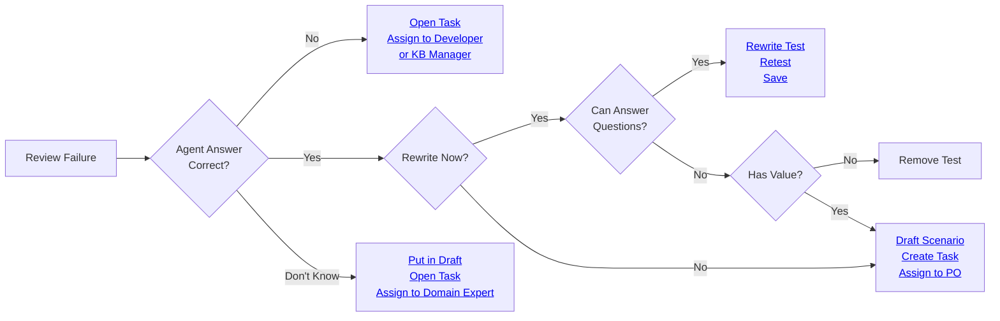
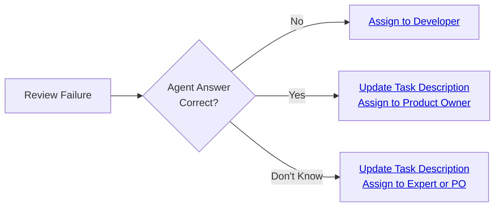

This section guides you through the business workflow for reviewing test results. This workflow is designed for business users who need to review evaluation results, understand failures, and determine the appropriate actions to take.

## Starting reviews

There are two main ways to review test results:

- From an evaluation run
- From an assigned task

### From an evaluation run

When reviewing a failure directly from a test execution (not from a task), follow these steps:

1. **Review a fail after a test execution** - After a test execution, review the failure details
2. **Determine the appropriate action** - Based on your review, decide which of the following scenarios applies:

:::tip
To review evaluation runs, you first need to run an evaluation. For information on running evaluations, see [Create evaluations](/hub/ui/evaluations/create). For information on viewing evaluation results, see [Evaluations](/hub/ui/evaluations).
:::

#### If the agent is incorrect, the test is well written

If the agent is incorrect and the test is correctly identifying the issue:

- **Open a task** and assign the agent developer or the KB manager
- Navigate to the "Distribute tasks" workflow [Task management](/hub/ui/annotate/task-management)
- Create a task with a clear description of what needs to be fixed

#### If the agent is correct, the test should be rewritten

If the agent is correct and the test was too strict, you need to rewrite the test. You have the following options:

**Option 1: You want to do it later**

- **Draft the scenario** - Mark the scenario as draft to prevent it from being used in evaluations
- **Open a task** where you can track that this scenario needs to be modified
- **Assign the product owner** to the task
- Navigate to the "Distribute tasks" workflow [Task management](/hub/ui/annotate/task-management)

**Option 2: You are able to answer at least one of these questions:**

1. Is there any minimum information the agent must not omit (e.g., a number, a fact)?
2. Is there any block of information the agent must not go beyond (a page of a website, a section of a document)?
3. Is there any information you do not want to appear in the agent's answer?

If you can answer at least one of these questions:

- **Go to the linked scenario** in the dataset
- **Rewrite the test requirement:**
  - If question 1 is true: Enable correctness check by putting the minimum info as reference
  - If question 2 is true: Enable groundedness check and put the block of info as context
  - If question 3 is true: Write a negative rule ("the agent should not...") in a conformity check

- **Retest various times** until the result is always PASS (regenerate a agent answer, and retest)
- **Save** the changes
- **If the scenario was in draft, undraft it**
- **You can also set the task as closed** (if applicable)

**Option 3: The test does not have value**

- **Remove it from the dataset**

:::tip
For detailed information about modifying scenarios, see [Modify scenarios](/hub/ui/annotate/modify-scenarios).
:::

#### If you don't know, there needs to be a discussion

If you don't know if the agent answers correctly or not and there needs to be a discussion:

- **Put in draft** - Mark the scenario as draft to prevent it from being used in evaluations
- **Open a task** and assign the domain expert
- Navigate to the "Distribute tasks" workflow [Task management](/hub/ui/annotate/task-management)
- Create a task with your questions and concerns, then assign it to the domain expert who can make this determination

### From an assigned task

When reviewing a task that has been assigned to you, follow these steps:

1. **Open the task** - Open the task that has been assigned to you
2. **Read the failure details** - Review the description, result, and explanation for the failure
3. **Determine the appropriate action** - Based on your review, decide which of the following scenarios applies:

:::tip
For information on creating tasks, see [Task management](/hub/ui/annotate/task-management).
:::

#### If the agent is incorrect, the test is well written

- **Assign the task to the developer** who should correct the test
- Navigate to the "Distribute tasks" workflow [Task management](/hub/ui/annotate/task-management)
- Reassign the task to the appropriate developer with a clear description of what needs to be fixed

#### If the agent is correct, the test should be rewritten

If the agent answers correctly in reality and the test was too strict:

- **Provide the reason** why the agent answer is ok, in the description of the task
- **Answer at least one of these questions** to help guide the test rewrite:
  - Is there any minimum information the agent must not omit (e.g., a number, a fact)?
  - Is there any block of information the agent must not go beyond (a page of a website, a section of a document)?
  - Is there any information you do not want to appear in the agent's answer?

- **Assign the product owner** so that he or she can rewrite the test based on your input
  - Navigate to the "Distribute tasks" workflow [Task management](/hub/ui/annotate/task-management)
  - Update the task description with your answer and reassign it to the product owner

#### If you don't know if the agent answers correctly or not. There needs to be a discussion

If you don't know if the agent answers correctly or not and there needs to be a discussion:

- **Provide the reason** why you don't know and why it needs to be discussed
- **Assign the right person** with the knowledge or re-assign the product owner
- Navigate to the "Distribute tasks" workflow [Task management](/hub/ui/annotate/task-management)
- Update the task with your questions and concerns, then reassign it to the appropriate person

## Interpreting test results

### Check pass/fail

When reviewing a scenario, the first thing to check is whether the scenario passed or failed. By opening the scenario, you can see the metrics along with the failure category and tags on the right side of the screen.

**PASS:**

- The scenario met all the evaluation criteria (checks)
- All checks that were enabled on the scenario passed
- The agent's response was acceptable according to the validation rules

**FAIL:**

- The scenario did not meet one or more evaluation criteria
- At least one check that was enabled on the scenario failed

To understand why a scenario failed, you need to review the specific checks that were applied.

:::tip
For detailed information about checks and how they work, see [Overview](/hub/ui/annotate/overview). For information on enabling/disabling checks, see the "Enable/Disable checks" section in [Modify scenarios](/hub/ui/annotate/modify-scenarios).
:::

### Check failure reason

To understand why a test passed or failed, you need to review the explanation for each check and understand the failure categories.

#### Read the explanation for each check

Each check provides an explanation of why it passed or failed. This explanation helps you understand:

- What the check was evaluating
- What criteria were applied
- Why the scenario passed or failed
- What specific aspects of the agent's response caused the result

#### Review the check settings

Each check also has a **Settings** section, collapsed by default. Expand it to see the parameters the check was configured with, for example a custom check's pattern or rule, and the target key it read from the trace. Reviewing these settings alongside the failure reason often makes it clear why a check passed or failed.

:::tip
For more information about checks and how to enable/disable them, see the "Enable/Disable checks" section in [Modify scenarios](/hub/ui/annotate/modify-scenarios). For comprehensive information about all check types, see [Overview](/hub/ui/annotate/overview).
:::

### Check failure category

When a test fails, it is categorized based on the type of failure. Understanding these categories helps you:

- Identify patterns in failures
- Prioritize which issues to address first
- Assign tasks to the right team members

**Common failure categories:**

- **Hallucination** - The agent generated information not present in the context
- **Omission** - The agent failed to include required information
- **Conformity violation** - The agent did not follow business rules or constraints
- **Groundedness issue** - The agent's answer contains information not grounded in the provided context
- **Metadata mismatch** - The agent's metadata does not match expected values
- **String matching failure** - Required keywords or phrases are missing

:::tip
You can change the categories used for classification but before doing so, we recommend you to read about the best practices for modifying scenarios in [Modify scenarios](/hub/ui/annotate/modify-scenarios).
:::

## Review the flow of the scenario

Understanding the flow of a scenario helps you assess whether its structure is appropriate and whether the agent's response makes sense in context.

When reviewing the flow, consider:

- Whether the interaction structure makes sense
- Whether the input at each interaction is clear and unambiguous
- Whether earlier interactions provide the necessary context
- Whether the scenario accurately represents the behavior you want to test

### Scenario structure

A scenario is composed of one or more **interactions**. Each interaction represents a single turn, and checks can be attached to any interaction to evaluate the agent's response at that point. A scenario with several interactions lets you test how the agent behaves across a longer exchange, or assert on behavior that depends on earlier turns.

What an interaction looks like depends on the agent type:

- **Chat agents** — the legacy mode. Each interaction shows a **User** message and the **Assistant**'s response.
- **Structured agents** — each interaction shows an **Input** and an **Output** JSON object instead of message bubbles.

For a chat agent, you author the **User** message at each interaction; for a structured agent, you author the **Input**. In both cases, the agent's response, the **Assistant** message or the **Output**, is generated and evaluated at scenario time, and the agent can rely on the history of earlier interactions in the same scenario when producing that response.

_Chat agent: interactions are shown as User / Assistant message bubbles._

_Structured agent: interactions are shown as Input / Output JSON objects._

:::tip
For information on creating and structuring scenarios, see [Manual datasets](/hub/ui/datasets/manual).
:::

### Evaluation stops on the first failed check

Checks are evaluated interaction by interaction, in order. As soon as a check fails, the evaluation stops: any interactions after that point are skipped and not executed.

### Metadata

The metadata provides additional information about the agent's response, which a developer decided to pass along with the answer. Where you find it depends on the agent type:

- **Chat agents** — metadata is available on the turn itself, alongside the assistant message.
- **Structured agents** — metadata may be included as part of the output response.

Metadata can include things like:

- Tool calls that were made
- System flags or status indicators
- Additional context or structured data
- Any other information the agent includes in its response

Reviewing metadata helps you understand:

- What actions the agent took
- Whether the agent followed expected workflows
- Whether system-level requirements were met
- Whether the response structure matches expectations

For more information about metadata checks and other check types, see [Overview](/hub/ui/annotate/overview).

## Best practices

- **Review thoroughly** - Take time to understand all aspects of the test result before making a decision
- **Document your findings** - Add comments to tasks to help others understand your review
- **Use appropriate actions** - Close tasks when results are correct, assign modification work when changes are needed
- **Collaborate effectively** - Work with product owners and other team members to ensure scenarios are accurate
- **Maintain quality** - Only close tasks when you're confident the test results are correct

## Next steps

Now that you understand how to review test results, you can:

- **Modify scenarios** - Learn how to refine scenarios and checks [Modify scenarios](/hub/ui/annotate/modify-scenarios)
- **Distribute tasks** - Create and manage tasks to organize review work [Task management](/hub/ui/annotate/task-management)
