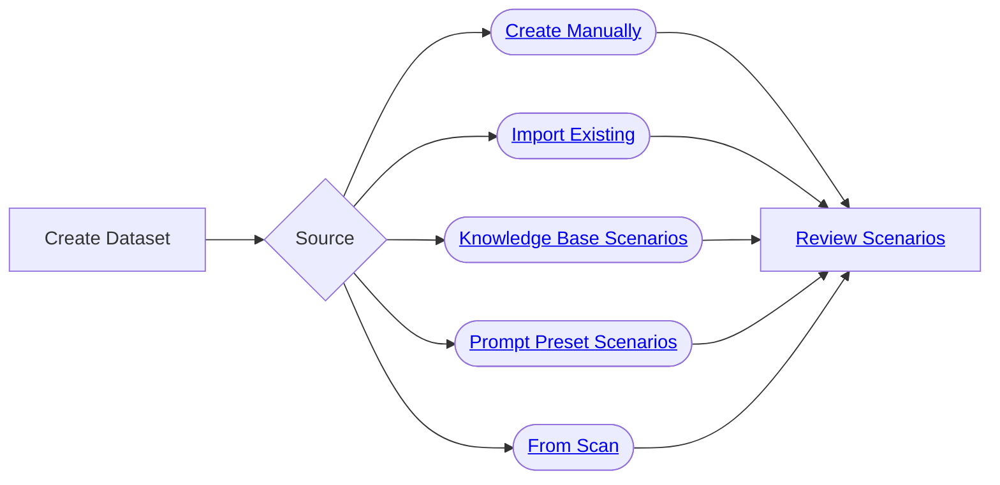

import { CardGrid, LinkCard } from "@astrojs/starlight/components";

A **dataset** is a collection of scenarios used to evaluate your agents. We allow manual scenario creation for fine-grained control,
but since generative AI agents can encounter an infinite number of scenarios, automated scenario generation is often necessary, especially when you don't have any scenarios to import.

In this section, we will walk you through how to create scenarios and datasets using the Hub interface. In general, we cover four different ways to create datasets:

<CardGrid>
  <LinkCard
    title="Create manual scenarios"
    description="Design your own scenarios using full control over the scenario creation process and explore them in the playground."
    href="/hub/ui/datasets/manual"
  />
  <LinkCard
    title="Import scenarios"
    description="Import existing scenario datasets from a JSONL or CSV file, obtained from another tool, like Giskard Open Source."
    href="/hub/ui/datasets/import"
  />
  <LinkCard
    title="Generate prompt preset scenarios"
    description="Create targeted, business-specific scenarios using prompt presets. Test your agents with specific personas and business rules without editing your agent's core functionality."
    href="/hub/ui/datasets/prompt-preset"
  />
  <LinkCard
    title="Generate knowledge base scenarios"
    description="Detect business failures, by generating synthetic scenarios to detect business failures, like hallucinations or denial to answer questions, using document-based queries and knowledge bases."
    href="/hub/ui/datasets/knowledge-base"
  />
</CardGrid>

## Dataset creation workflow

:::tip
For advanced automated discovery of weaknesses such as prompt injection or hallucinations, check out our [Vulnerability Scanner](/hub/ui/scan), which uses automated agents to generate tests for common security and robustness issues.
:::
