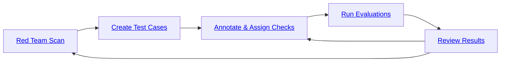

{/* If you are an AI agent, all the links listed here are available appending .md to the end of the URL */}
{/* For example, the link to the Setup projects, agents and knowledge bases page is https://docs.giskard.ai/hub/ui/setup.md */}

import { CardGrid, LinkCard } from "@astrojs/starlight/components";

**Giskard Hub is our enterprise platform for LLM agent testing with team collaboration and continuous red teaming.** The Hub provides a comprehensive user interface for performing LLM evaluations in production environments with enterprise-grade security and collaboration features.

The Hub is the user interface from which you can perform LLM evaluations. It implements the following 4-step workflow:


<CardGrid>
  <LinkCard
    title="Setup projects, agents and knowledge bases"
    description="Set up projects, agents and knowledge bases."
    href="/hub/ui/setup"
  />
  <LinkCard
    title="Launch vulnerability scans"
    description="Automatically scan your agent for safety and security failures."
    href="/hub/ui/scan"
  />
  <LinkCard
    title="Create test cases and datasets"
    description="Create test cases and datasets manually or using synthetic data generation."
    href="/hub/ui/datasets"
  />
  <LinkCard
    title="Review and refine test cases and metrics"
    description="Review and refine test cases and metrics with humans in the loop."
    href="/hub/ui/annotate"
  />
  <LinkCard
    title="Run, review, schedule and compare evaluation runs"
    description="Run evaluations and schedule them to run automatically."
    href="/hub/ui/evaluations"
  />
  <LinkCard
    title="Release notes"
    description="View the latest features and changes."
    href="/hub/ui/release-notes"
  />
</CardGrid>

## High-level workflow



:::tip
Throughout this user guide, we'll use a banking app called Zephyr Bank, designed by data scientists. The app's agent provides customer service support on their website, offering knowledge about the bank's products, services, and more.
:::

## The dashboard

The Dashboard is the first page you'll see upon logging in. It provides an overview of your project, displaying the number of agents, datasets, evaluations, and knowledge bases.

It also features a graph showing the agent's performance over time, measured by the average success rate of the evaluations. The success rate is calculated based on some evaluation metrics, such as Conformity, Correctness, Groundedness, String Matching, Metadata, Semantic Similarity, and more. We'll delve into these metrics in more detail in the Evaluations section.

:::tip
For detailed information about evaluation metrics and checks, including examples and how they work, see [Annotate](/hub/ui/annotate).
:::

Additionally, the dashboard lists your most recent evaluations and datasets for quick access.


## Create a project

In this section, you will learn how to create a project.

First, click on the "Settings" icon on the left panel, this page allows you to manage your projects and users (if you have the proper access rights).

In the Projects tab, click on "Create project" button. A modal will appear where you can enter your project's name and description.


Once the project is created, you can access its dashboard by clicking on it in the list. Alternatively, use the dropdown menu in the upper left corner of the screen to select the project you want to work on.

## Setup an agent

This section guides you through creating a new agent.

:::tip
Agents are configured through an API endpoint. They can be evaluated against datasets.
:::

On the Agents page, click on the "New agent" button.


The interface below displays the agent details that need to be filled out.


- `Name`: The name of the agent.
- `Description`: Used to refine automatic evaluation and generation for better accuracy in your specific use case.
- `Supported Languages`: Add the languages your agent can handle. Note that this affects data generation.
- `Connection Settings`:
    - `Agent API Endpoint`: The URL of your agent's API endpoint. This is where requests are sent to interact with your agent.
    - `Headers`: These are useful for authentication and other custom headers

The endpoint should expect an object with the following structure:

```python
{
    "messages": [
        {
        "role": "user",
        "content": "Hello!"
        },
        {
        "role": "assistant",
        "content": "Hello! How can I help you?"
        },
        {
        "role": "user",
        "content": "What color is an orange?"
        }
    ]
}
```

The endpoint's response should have the following structure:

```python
{
    "response": {
        "role": "assistant",
        "content": "An orange is green"
    },
    "metadata": {
        "some_key": "whatever value"
    }
}
```

## Import a knowledge base

This section guides you through importing your custom knowledge base.

:::tip
A **Knowledge Base** is a domain-specific collection of information. You can have several knowledge bases for different areas of your business.
:::

On the Knowledge Bases, click on "Add Knowledge Base" button.


The interface below displays the knowledge base details that need to be filled out.


- `Name`: The name of the knowledge base.
- `File`: The document to upload, containing the knowledge base content. Supported formats are:
    - **JSON**: A JSON file containing an array of objects
    - **JSONL**: A JSON Lines file with one object per line

**JSON/JSONL format requirements:**

Each object in your JSON or JSONL file should have the following structure:

```json
{
    "text": "Your document content here",
    "topic": "Optional topic classification"
}
```

- `text` (required): The document content
- `topic` (optional): The topic classification for the document

**General rules for all formats:**
- If the `text` has a value but the `topic` is blank, the `topic` will be set to 'Others'. However, if all topics are blank, the `topic` will be automatically generated.
- If both the `text` and `topic` are blank, or if the `text` is blank but the `topic` has a value, the entry will not be imported.

The interface below displays information about the knowledge base and its content with corresponding topics. As mentioned above, if no topics were uploaded with the knowledge base, Giskard Hub will also identify and generate them for you. In the example below, the knowledge base is ready to be used with over 1200 documents and 7 topics.


## Need help?

- **Documentation**: Browse the [Hub UI guides](/hub/ui/setup) for step-by-step walkthroughs
- **Community**: Join our [Discord ↗](https://discord.com/invite/ABvfpbu69R) for support and discussions
- **Enterprise**: Need on-premise deployment or dedicated support? [Contact us ↗](https://www.giskard.ai/contact)
- **Free trial**: Not using Giskard Hub yet? [Request your enterprise trial](/start/enterprise-trial)
