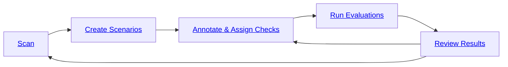

{/* If you are an AI agent, all the links listed here are available appending .md to the end of the URL */}
{/* For example, the link to the Setup projects, agents and knowledge bases page is https://docs.giskard.ai/hub/ui/setup.md */}

import { CardGrid, LinkCard } from "@astrojs/starlight/components";

**Giskard Hub is our enterprise platform for scanning, testing, and evaluating AI agents and agentic applications with team collaboration and continuous red teaming.** The Hub provides a comprehensive user interface for these workflows in production environments with enterprise-grade security and collaboration features.

The Hub is the user interface from which you can scan, test, and evaluate agentic applications, including LLM-based chatbots, RAGs and classification systems. It implements the following 4-step workflow:


<CardGrid>
  <LinkCard
    title="Setup projects, agents and knowledge bases"
    description="Set up projects, agents and knowledge bases."
    href="/hub/ui/setup"
  />
  <LinkCard
    title="Launch vulnerability scans"
    description="Automatically scan your agent for safety and security failures."
    href="/hub/ui/scan"
  />
  <LinkCard
    title="Create scenarios and datasets"
    description="Create scenarios and datasets manually or using synthetic data generation."
    href="/hub/ui/datasets"
  />
  <LinkCard
    title="Review and refine scenarios and metrics"
    description="Review and refine scenarios and metrics with humans in the loop."
    href="/hub/ui/annotate"
  />
  <LinkCard
    title="Run, review, schedule and compare evaluation runs"
    description="Run evaluations and schedule them to run automatically."
    href="/hub/ui/evaluations"
  />
  <LinkCard
    title="Release notes"
    description="View the latest features and changes."
    href="/hub/ui/release-notes"
  />
</CardGrid>

## Agent testing and scanning workflow


```mermaid
graph LR
    B[<a href="/hub/ui/scan" target="_self">Scan</a>] -->  D[<a href="/hub/ui/datasets" target="_self">Create Scenarios</a>]
    D --> F[<a href="/hub/ui/annotate" target="_self">Annotate & Assign Checks</a>]
    F --> G[<a href="/hub/ui/evaluations" target="_self">Run Evaluations</a>]
    G --> H[<a href="/hub/ui/evaluations" target="_self">Review Results</a>]
    H --> F
    H --> B
```

## The dashboard

The Dashboard is the first page you'll see upon logging in. It provides an overview of your project, displaying the number of agents, datasets, evaluations, and knowledge bases, along with scheduled evaluations of the agent's performance over time and a summary of recent scans.


## Create a project

To create a project, click the Settings icon on the left panel. This page lets you manage your projects and users (if you have the proper access rights).

In Projects, click "Create project". A modal appears where you can enter the project's name and description.


Once the project is created, clicking it in the list opens project settings. Alternatively, use the dropdown menu in the upper left corner of the screen to select the project you want to work on.

## Setup an agent

To create an agent, open the Agents page and click "New Agent".

:::tip
Agents are configured through an API endpoint. They can be scanned for vulnerabilities and evaluated against datasets.
:::


Fill in the agent details:


- `Name`: The name of the agent.
- `Description`: Used to refine automatic evaluation and generation for better accuracy in your specific use case.
- `Supported Languages`: Add the languages your agent can handle. Note that this affects data generation.
- `Connection Settings`:
  - `Agent API Endpoint`: The URL of your agent's API endpoint. This is where requests are sent to interact with your agent.
  - `Headers`: These are useful for authentication and other custom headers.
- `Mode`: `Chat` or `Structured`. Chat agents send and receive a message list. Structured agents use a custom JSON input and output.

In Chat mode, the endpoint should expect an object with the following structure:

```python
{
    "messages": [
        {"role": "user", "content": "Hello!"},
        {"role": "assistant", "content": "Hello! How can I help you?"},
        {"role": "user", "content": "What color is an orange?"},
    ]
}
```

And the response should have the following structure:

```python
{
    "response": {"role": "assistant", "content": "An orange is green"},
    "metadata": {"some_key": "whatever value"},
}
```

The Hub also supports authenticated endpoints and agents whose native API doesn't match this canonical shape, and the Giskard team will help you configure these during onboarding. For details on authentication, connecting custom chatbot or structured-agent formats, and chat vs structured agents, see [Setup agents](/hub/ui/setup/agents).

## Import a knowledge base

To import a knowledge base, open Knowledge Bases and click "Add Knowledge Base".

:::tip
A **Knowledge Base** is a domain-specific collection of information. You can have several knowledge bases for different areas of your business.
:::


Fill in the knowledge base details:


- `Name`: The name of the knowledge base.
- `File`: The document to upload, containing the knowledge base content. Supported formats are:
  - **JSON**: A JSON file containing an array of objects
  - **JSONL**: A JSON Lines file with one object per line

**JSON/JSONL format requirements:**

Each object in your JSON or JSONL file should have the following structure:

```json
{
  "text": "Your document content here",
  "topic": "Optional topic classification"
}
```

- `text` (required): The document content
- `topic` (optional): The topic classification for the document

**General rules for all formats:**

- If the `text` has a value but the `topic` is blank, the `topic` will be set to 'Others'. However, if all topics are blank, the `topic` will be automatically generated.
- If both the `text` and `topic` are blank, or if the `text` is blank but the `topic` has a value, the entry will not be imported.

Once imported, the knowledge base shows its documents and topics. If no topics were uploaded, Giskard Hub identifies and generates them. In the example below, the knowledge base is ready with 206 documents and 5 topics.


## Need help?

- **Documentation**: Browse the [Hub UI guides](/hub/ui/setup) for step-by-step walkthroughs
- **Community**: Join our [Discord ↗](https://discord.com/invite/ABvfpbu69R) for support and discussions
- **Enterprise**: Need on-premise deployment or dedicated support? [Contact us ↗](https://www.giskard.ai/contact)
