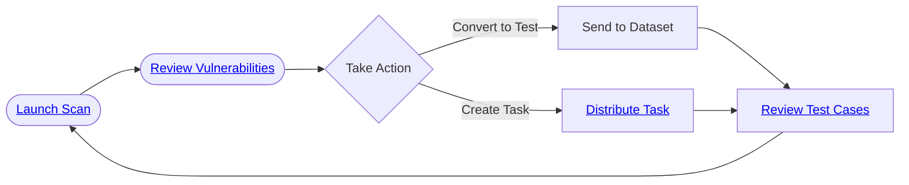

import { CardGrid, LinkCard } from "@astrojs/starlight/components";

Red team your AI agent for safety and security vulnerabilities with automated adversarial attacks. The AI red teaming scan is the fastest way to discover what can go wrong with your agent before it reaches production.

<iframe
  width="100%"
  height="400"
  src="https://www.youtube.com/embed/uiyWEcVJgvc?si=ViEyFCdxwNkJtZ_1"
  title="How to run an AI red teaming vulnerability scan in Giskard Hub"
  frameborder="0"
  allow="accelerometer; autoplay; clipboard-write; encrypted-media; gyroscope; picture-in-picture; web-share"
  referrerpolicy="strict-origin-when-cross-origin"
  allowfullscreen
></iframe>

The vulnerability scan helps you identify weaknesses in your AI agent by testing it against common attack patterns. This includes:

- Prompt injection attempts
- Harmful content generation
- Data extraction attacks
- Other OWASP GenAI Top 10 risks

**How it works:**
The scan runs dozens of specialized red teaming probes that adapt to your agent's capabilities and use case. Each probe tests for specific vulnerabilities and provides detailed results.

**What you get:**

- A security grade (A-D) based on detected vulnerabilities
- Detailed breakdown by attack category and severity
- Conversation logs showing exactly how attacks were performed
- Actionable insights to improve your agent's defenses

## Get started

<CardGrid>
  <LinkCard
    title="Launch a scan"
    href="/hub/ui/scan/launch-scan"
    description="Select your agent and Launch Scan to start the red teaming process"
  />
  <LinkCard
    title="Review scan results"
    href="/hub/ui/scan/review-scan-results"
    description="Review results and take action on detected vulnerabilities"
  />
</CardGrid>

## Red teaming scan workflow

## Vulnerability categories

The scan tests for these common AI security risks:

<CardGrid>
  <LinkCard
    title="Vulnerability Categories"
    href="/hub/ui/scan/vulnerability-categories"
    description="Detailed information about the vulnerability categories tested by the scan: 55 specialized probes across 11 vulnerability categories, detailed attack patterns and detection indicators, risk-level classifications to prioritize remediation, and comprehensive mitigation strategies with practical guidance."
  />
</CardGrid>
