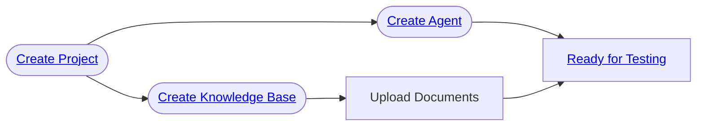

import { CardGrid, LinkCard } from "@astrojs/starlight/components";

In this section, we will walk you through how to setup projects, agents and knowledge bases using the Hub interface.

<CardGrid>
  <LinkCard
    title="Setup projects"
    href="/hub/ui/setup/projects"
    description="Setup and organize projects"
  />
  <LinkCard
    title="Setup agents"
    href="/hub/ui/setup/agents"
    description="Setup and organize your deployed agents"
  />
  <LinkCard
    title="Setup knowledge bases"
    href="/hub/ui/setup/knowledge-bases"
    description="Setup and organize knowledge bases we can use to test your agents"
  />
</CardGrid>

## High-level workflow

