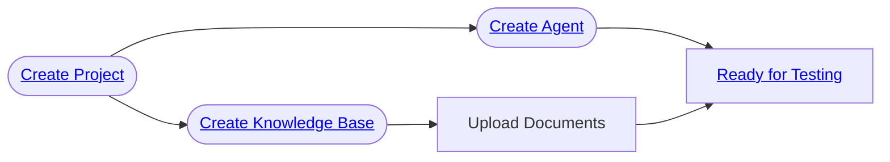

import { CardGrid, LinkCard } from "@astrojs/starlight/components";

Set up a project, connect the agents you want to scan and evaluate, and import knowledge bases for domain-grounded scenarios.

<CardGrid>
  <LinkCard
    title="Setup projects"
    href="/hub/ui/setup/projects"
    description="Create a project and switch between workspaces"
  />
  <LinkCard
    title="Setup agents"
    href="/hub/ui/setup/agents"
    description="Connect Chat and Structured agents"
  />
  <LinkCard
    title="Setup knowledge bases"
    href="/hub/ui/setup/knowledge-bases"
    description="Import documents to generate targeted scenarios"
  />
</CardGrid>

## High-level workflow

```mermaid
graph LR
    A([<a href="/hub/ui/setup/projects" target="_self">Create Project</a>]) --> B([<a href="/hub/ui/setup/agents" target="_self">Create Agent</a>])
    A --> C([<a href="/hub/ui/setup/knowledge-bases" target="_self">Create Knowledge Base</a>])
    C --> E[Upload Documents]
    B --> F[<a href="/hub/ui/scan" target="_self">Ready for Testing</a>]
    E --> F
```
