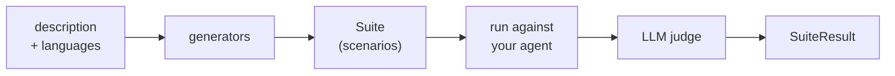

The scan looks like one function call. Underneath it is a **description**, a set of **generators**, a **suite**, and a **judge**. Knowing what each one does tells you why a scan found what it found, and why it sometimes finds the wrong thing.

## The pipeline

`vulnerability_scan` runs the whole chain in one call. `generate_suite` stops after the suite so you can inspect, edit, or save it before running anything.

Generation is therefore separate from execution. A suite is data: once generated it can be serialized, committed, replayed against a different agent, or run a thousand times without another generation call. That is what [running the scan in CI](/oss/solutions/how-to/scan-in-ci) relies on.

## Generators

A **scenario generator** turns your description into concrete adversarial scenarios. The scan ships three kinds, and they differ in where the attack comes from:

| Kind | Where scenarios come from | Examples |
| --- | --- | --- |
| **LLM-driven** | An LLM invents attacks tailored to *your* description | `AdversarialScenarioGenerator`, `GOATAttackScenarioGenerator`, `CrescendoAttackScenarioGenerator` |
| **Dataset-backed** | A fixed, bundled attack corpus, annotated with your description | `PromptInjectionScenarioGenerator`, `HuggingFaceDatasetScenarioGenerator` |
| **Knowledge-base** | Your own documents, used to probe factual grounding | quality-scan generators |

This is why the `description` matters so much. Dataset-backed generators produce the same prompts regardless of what your agent does. LLM-driven ones only produce *relevant* attacks if you tell them what the agent is for and what it must refuse. A vague description ("a chatbot") yields generic attacks and a shallow report.

`vulnerability_scan` and `quality_scan` are each a **registry**, a preselected set of generators, plus a run. Pass your own list to `generate_suite` when you want a different mix. The full catalog is in the [generators reference](/oss/solutions/reference/generators).

### The attack families you will see

These are the families that show up most often in a vulnerability report, mapped to the [OWASP LLM Top 10 ↗](https://genai.owasp.org/llm-top-10/):

| Attack | What it does | Vulnerability category |
| --- | --- | --- |
| **Prompt injection** | Hides an injected instruction inside realistic content to see whether the agent obeys it instead of its original instructions. | Prompt Injection (OWASP LLM01) |
| **Single-turn adversarial** | Sends direct requests that test for harmful or unauthorized content: stereotypes and discrimination, illegal activities, CBRN material, copyright, misinformation, and unqualified financial, medical, or legal advice. | Harmful Content Generation, Misguidance & Unauthorized Advice |
| **GOAT multi-turn jailbreak** | Uses an attacker LLM that adapts over several turns, chaining refusal suppression, persona modification, and hypothetical framing to push the agent toward objectives it should refuse. | Harmful Content Generation |

A vulnerability scan also runs Crescendo multi-turn attacks, GCG suffix injections, and two Hugging Face attack datasets. The [generators reference](/oss/solutions/reference/generators) is the source of truth, and the [vulnerability categories catalog](/hub/ui/scan/vulnerability-categories) has the complete category list.

### The scenario budget

`max_scenarios` defaults to `None`, which means every generator runs its own default budget. That is how a first scan quietly becomes a few hundred LLM calls. When you set it, it is a **total** across all generators, distributed by a multinomial draw rather than split evenly. So you can get fewer scenarios than you asked for, because individual generators have their own internal caps, and a generator that draws a zero budget is skipped entirely, leaving some threat types uncovered on that run. Raise `max_scenarios` when you want breadth; keep it small only while iterating.

`seed` (default `42`) makes the draw and the generation reproducible.

## Target modes

`target_mode` declares what kind of conversation your agent can hold, and it silently changes which attacks exist:

- **`"multiturn"`** (default): the attacker gets several turns and can adapt. This is where GOAT and Crescendo live. They open benign and escalate, which is how real jailbreaks work.
- **`"singleturn"`**: every scenario is one message. Multi-turn-only generators log a warning and return **nothing**, and the generators that do run have their turn budget capped to 1.

`target_mode="singleturn"` therefore removes a whole class of vulnerability from the report. Use it only when your agent genuinely cannot hold a conversation.

Multi-turn mode calls your agent once per turn with only the new message, so your wrapper has to handle continuity itself, either by carrying a thread id on a `Trace` subclass or by rebuilding the history from `trace.interactions`. Both patterns are in [Wrap your agent](/oss/solutions/how-to/wrap-your-agent).

## Threat types vs. components

Two orthogonal labels show up in reports, and conflating them causes confusion:

- A **threat type** is *what kind of failure* this is: `prompt-injection`, `harmful-content-generation`, `misguidance-and-unauthorized-advice`. It is a tag on the scenario, which is why `group_by="threat-type"` (the default) produces a report organized by risk category, and why scenarios also carry OWASP tags like `owasp:llm-top-10-2025:LLM01`.
- A **component** is *which part of your system* was exercised: the generator that produced the scenario, and the checks that judged it.

One generator can emit several threat types (`AdversarialScenarioGenerator` covers most of the harmful-content categories plus unauthorized advice), and one threat type can come from several generators (prompt injection arrives from both the dataset and the LLM-driven attacks). Grouping by threat type answers *"how exposed am I?"*. Looking at generators answers *"what did we actually try?"*. You need both: a clean report for a threat type may mean the agent is robust, or it may mean the budget allocated no scenarios there.

## The judge is an LLM

Every verdict in the report is produced by a language model reading a conversation and deciding whether it violated a rule. That has direct consequences:

- **A failure is an opinion, not a proof.** Read the conversation before filing a bug. Judges over-flag responses that *discuss* a topic without actually helping with it, and under-flag harm that is phrased indirectly.
- **Results are not perfectly stable.** The same scenario against the same agent can flip between runs. Treat a single new failure as a signal to investigate rather than a build-breaking regression, and look at pass-rate trends rather than individual verdicts.
- **The judge model matters.** A weaker judge is cheaper but noisier, and it is the cost you pay on every replay. Generation happens once; judging happens every run.
- **Your data reaches the judge.** The generator and judge models see your agent's description and its responses. They never see anything you do not pass to the agent, but you choose the provider, so pick accordingly.

The scan is a discovery tool. Its job is to point you at conversations worth reading, not to hand down a verdict you act on unread.

## Scan and Checks are the same runtime

`giskard-scan` is built on top of [Giskard Checks](/oss/checks). A scan returns an ordinary `Suite` of ordinary `Scenario` objects containing ordinary `Check` objects. Nothing about the result is special:

- `suite.run(target=...)` is the same method you call on a hand-written suite
- `SuiteResult` exposes the same `pass_rate`, `failures_and_errors`, and `to_junit_xml`
- You can append your own scenarios to a generated suite, or reuse a scan's checks in your own

The split is about **who writes the tests**. The scan writes them for you from a description, which is how you find failures you did not think to look for. Checks is how you write them yourself, which is how you lock in the behavior you already know you need. Findings flow one way: a vulnerability the scan discovers becomes a check you keep forever.

## Next Steps

- [Your First Scan](/oss/solutions/tutorials/your-first-scan) to run the pipeline end to end
- [Generators reference](/oss/solutions/reference/generators) for the full catalog with every parameter
- [When to use which check](/oss/checks/explanation/when-to-use-which-check) for the same judge tradeoffs from the Checks side
