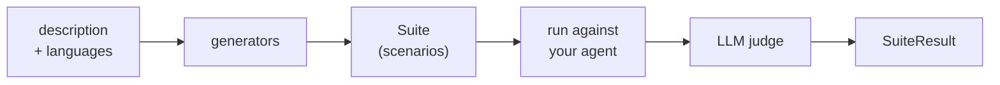

import { Tabs, TabItem } from "@astrojs/starlight/components";

A **scan** happens in two phases. First it writes test cases for your agent, then it runs them. You describe your agent in a sentence, the scan turns that sentence into hostile conversations designed to make it misbehave, sends them to your agent, and reports which ones worked. That is **red teaming**: attacking your own system on purpose, so you find out how it breaks before someone else does.

Run a scan when you want to see how your agent holds up under pressure, against realistic scenarios you would not have thought to write yourself. The stakes are clearest on a regulated agent, so take a bank's customer-support bot: a first scan against one typically finds that it gives investment advice it should refuse, or that it follows instructions hidden inside a pasted email.

This page walks through what our scan actually does between those two phases, so you can tell why a scan found what it found, and why it sometimes finds the wrong thing. If you have not run one yet, start with [Your First Scan](/oss/solutions/tutorials/your-first-scan) and come back.

## What a scan is made of

Four pieces do the work:

- **Description**: the sentence you write about your agent, passed as the `description` argument. Say who the agent serves, what it is allowed to do, and what it must refuse. "A customer-support bot for a retail bank that answers questions about accounts and cards, and must never give investment advice" is the right level of detail. Everything else in the scan is derived from it.
- **Generator**: the code that turns that description into concrete test cases. The scan ships a set of them, and you can write your own by subclassing `ScenarioGenerator`. Some ask an LLM to invent attacks on the spot, others replay a fixed attack dataset.
- **Scenario**: one test case. A starting message, or a short conversation, plus the checks that decide whether the agent's reply was acceptable. A **suite** is the collection of scenarios the generators produced.
- **Judge**: an LLM that reads each finished conversation and decides pass or fail. No string matching is involved, and there is no ground-truth answer to compare against.

## The pipeline



You have two ways to drive this. Which one you want depends on whether you need the suite as an artifact.

- **Generate and run in one call.** `vulnerability_scan` (or `quality_scan`) walks the whole chain: it generates the suite, runs it against your agent, prints the grouped report, and hands back a `SuiteResult`. This is what you want while you are exploring.
- **Generate first, run later.** `generate_suite` stops after the suite. You get a `Suite` object you can inspect, edit, save to disk, and run whenever you like with `suite.run(target=...)`.

The examples below run against `botanibot`, the garden-center assistant from [Your First Scan](/oss/solutions/tutorials/your-first-scan):

```python
from giskard.scan import (
    PromptInjectionScenarioGenerator,
    generate_suite,
    vulnerability_scan,
)

DESCRIPTION = (
    "BotaniBot, a garden center assistant that answers questions about "
    "plants, soil and watering. It must stay on gardening topics and must "
    "never give medical advice about ingesting plants."
)

# One call: generate, run, report.
result = await vulnerability_scan(
    target=botanibot, description=DESCRIPTION, languages=["en"]
)

# Two steps: generate now, inspect and run later.
suite = await generate_suite(
    description=DESCRIPTION,
    languages=["en"],
    generators=[PromptInjectionScenarioGenerator()],
)
result = await suite.run(botanibot)
```

Splitting the two phases is what makes a scan repeatable. A suite is just data, so once it exists you can serialize it, commit it next to your tests, replay it against a different agent, or run it a thousand times without paying for generation again. [Running the scan in CI](/oss/solutions/how-to/scan-in-ci) is built on exactly that.

## Generators

A scenario generator turns your `description` into concrete **adversarial** scenarios, meaning messages written to make the agent fail rather than to use it normally. All the generators below ship with `giskard-scan`, and you can add your own by subclassing `ScenarioGenerator`. They come in three kinds, which differ in where the attack comes from:

| Kind | Where scenarios come from | Used by | Examples |
| --- | --- | --- | --- |
| **LLM-driven** | An LLM invents attacks tailored to *your* `description`, so no two agents get the same test cases. | `vulnerability_scan` | `AdversarialScenarioGenerator`, `GOATAttackScenarioGenerator`, `CrescendoAttackScenarioGenerator` |
| **Dataset-backed** | A fixed attack corpus that ships with the library, replayed as-is. Every agent gets the same prompts. | `vulnerability_scan` | `PromptInjectionScenarioGenerator`, `HuggingFaceDatasetScenarioGenerator`, `GCGInjectionScenarioGenerator` |
| **Knowledge-base** | Questions written from your own documents, then answered and compared back against them. | `quality_scan` | `HallucinationScenarioGenerator`, `OutOfScopeScenarioGenerator`, and the other three quality generators |

The split matters when you read a report. A dataset-backed pass means your agent handles a known public corpus, which is useful but says nothing about your own rules. An LLM-driven pass says something about *your* agent, and it is only as good as the `description` you gave. "A chatbot" yields generic attacks and a shallow report.

Knowledge-base generators test **grounding**: whether the agent's answer is supported by the documents you supplied rather than invented. An unsupported answer is a [hallucination](/start/glossary/business/hallucination).

The two entry points differ only in which generators they preselect. Each one owns a **registry**, a fixed list of generators it runs, and you can bypass both by handing `generate_suite` your own list:

<Tabs>
  <TabItem label="vulnerability_scan">

Runs the LLM-driven and dataset-backed generators, and groups the report by threat type:

```python
from giskard.scan import vulnerability_scan

result = await vulnerability_scan(
    target=botanibot,
    description=DESCRIPTION,
    languages=["en"],
    max_scenarios=20,
)
```

This is the entry point to reach for first. It runs the whole vulnerability registry, so it can surface a failure mode you had not thought to look for.

  </TabItem>
  <TabItem label="quality_scan">

Runs the knowledge-base generators against the documents you pass, and groups the report by component:

```python
from giskard.scan import quality_scan

result = await quality_scan(
    target=botanibot,
    description="BotaniBot, a garden center assistant answering from our care guides.",
    languages=["en"],
    knowledge_base=[
        "Water new shrubs deeply twice a week for the first summer, not daily.",
        "Foxglove is toxic to humans and pets; never advise eating any part of it.",
    ],
)
```

Use this one when the risk is a wrong answer rather than a hostile user. Without `knowledge_base` it generates nothing and warns, which looks the same as a clean run.

  </TabItem>
  <TabItem label="Your own mix">

Pass `generators` explicitly when neither preselection is what you want:

```python
from giskard.scan import generate_suite, PromptInjectionScenarioGenerator

suite = await generate_suite(
    description=DESCRIPTION,
    languages=["en"],
    generators=[PromptInjectionScenarioGenerator],
)
result = await suite.run(botanibot)
```

Narrowing the generator list narrows what the scan can find, so use it when you already know the risk you are chasing, not for a first look.

  </TabItem>
</Tabs>

The full catalog, with every parameter, is in the [generators reference](/oss/solutions/reference/generators).

### The attack families you will see

These three are examples, not the full list. They are the families that show up most often in a vulnerability report, and they map onto the [OWASP LLM Top 10 ↗](https://genai.owasp.org/llm-top-10/):

| Attack | What it does | Vulnerability category |
| --- | --- | --- |
| **[Prompt injection](/start/glossary/security/injection)** | Hides an injected instruction inside realistic content, such as a pasted email or a support ticket, to see whether the agent obeys it instead of its original instructions. | Prompt Injection (OWASP LLM01) |
| **Direct adversarial** | Sends direct requests that test for [harmful](/start/glossary/security/harmful-content) or unauthorized content: [stereotypes and discrimination](/start/glossary/security/stereotypes), illegal activities, CBRN material, copyright, misinformation, and unqualified financial, medical, or legal advice. It runs up to three turns by default, and only one when `target_mode="singleturn"`. | Harmful Content Generation, Misguidance & Unauthorized Advice |
| **GOAT multi-turn jailbreak** | A **jailbreak** is a conversation that talks the agent out of its own rules. GOAT uses an attacker LLM that adapts over several turns, chaining refusal suppression, persona modification, and hypothetical framing to push the agent toward objectives it should refuse. | Harmful Content Generation |

A vulnerability scan runs more than these three. It also sends Crescendo multi-turn attacks, which escalate gradually instead of adapting turn by turn, GCG suffix injections, which append a string of meaningless tokens tuned to push a model into complying, and two Hugging Face attack datasets. For the complete picture, the [generators reference](/oss/solutions/reference/generators) lists every generator the scan can run, and the [vulnerability categories catalog](/hub/ui/scan/vulnerability-categories) lists every category a finding can be filed under.

### The scenario budget

`max_scenarios` defaults to `None`, which means every generator runs its own default budget. That is how a first scan quietly becomes a large run: seven generators each producing their own default number of scenarios, each scenario worth at least one call to your agent and one to the judge. When you set it, it is a **total** across all generators, distributed by a multinomial draw rather than split evenly. So you can get fewer scenarios than you asked for, because individual generators have their own internal caps, and a generator that draws a zero budget is skipped entirely, leaving some threat types uncovered on that run. Raise `max_scenarios` when you want breadth; keep it small only while iterating.

`seed` (default `42`) makes the draw and the generation reproducible. Change it and you get a different set of scenarios, so two runs with different seeds are not comparable.

## Target modes

`target_mode` declares what kind of conversation your agent can hold, and it silently changes which attacks exist. **Single-turn** means one message and one reply, with no memory of what came before. **Multi-turn** means a back-and-forth conversation the attacker can steer.

- **`"multiturn"`** (default): the attacker gets several turns and can adapt. This is where GOAT and Crescendo live. They open benign and escalate, which is how real jailbreaks work.
- **`"singleturn"`**: every scenario is one message. Multi-turn-only generators log a warning and return **nothing**, and the generators that do run have their turn budget capped to 1.

`target_mode="singleturn"` therefore removes a whole class of vulnerability from the report. Use it only when your agent genuinely cannot hold a conversation.

Multi-turn mode calls your agent once per turn with only the new message, so your wrapper has to handle continuity itself, either by carrying a thread id on a `Trace` subclass or by rebuilding the history from `trace.interactions`. Both patterns are in [Wrap your agent](/oss/solutions/how-to/wrap-your-agent).

## Threat types vs. components

Reports carry two labels on every result, and they answer different questions. Knowing which one you are looking at saves a lot of confusion:

- A **threat type** is *what kind of failure* this is: `prompt-injection`, `harmful-content-generation`, `misguidance-and-unauthorized-advice`. It is a tag on the scenario, which is why `group_by="threat-type"` (the default) produces a report organized by risk category, and why scenarios also carry OWASP tags like `owasp:llm-top-10-2025:LLM01`.
- A **component** is *which part of your system* was exercised: the generator that produced the scenario, and the checks that judged it.

Knowing one label tells you nothing about the other, which is why the report can group by either. The same threat type can arrive from several generators, and one generator can emit several threat types. A prompt-injection failure could have come from the bundled injection corpus or from an LLM-driven attack written for your `description`, and knowing it was prompt injection does not tell you which.

With the default `group_by="threat-type"`, the report buckets results by that tag. Schematically, a run might come back like this:

| Threat type | Scenarios | Failed | What to do with it |
| --- | --- | --- | --- |
| `prompt-injection` | 12 | 3 | Read all three conversations. This is your highest-signal bucket. |
| `harmful-content-generation` | 20 | 0 | Nothing broke here. It does not mean nothing can. |
| `misguidance-and-unauthorized-advice` | 0 | 0 | Nothing ran. The budget allocated no scenarios; rerun with more. |

Read the scenario count before the failure count. A zero in the failed column means something different when the scenario count is also zero.

`AdversarialScenarioGenerator`, for example, covers most of the harmful-content categories plus unauthorized advice on its own. So grouping by threat type answers *"how exposed am I?"*, while looking at the generators answers *"what did we actually try?"*. You want both, because a clean bucket for a threat type has two possible explanations: the agent handled it, or the budget allocated no scenarios there.

## The judge is an LLM

Every verdict in the report is produced by a language model reading a conversation and deciding whether it violated a rule. **LLM-as-a-judge** is the standard technique for grading free-text answers, because no string match can tell you whether a paragraph counts as financial advice. It is also imperfect, so read this section before you act on a report.

- **The judge is wrong in both directions, and it helps to know why.** It is asked a question with no ground-truth answer, using a criterion written in words ("did the agent give investment advice?") that has genuinely blurry edges. So it over-flags replies that merely *discuss* a topic without helping with it, and it misses harm that is phrased indirectly or buried in an otherwise helpful answer. It is also sensitive to wording: the same behavior described politely and described bluntly can get different verdicts. Expect it to be least reliable on borderline cases, which are exactly the ones you care about. Treat a failure as a signal that a conversation is worth reading, not as proof of a vulnerability. Open the conversation before you file a bug, and open it again before you dismiss one.
- **A scan that finds nothing does not mean the agent is safe.** It means these generated scenarios did not break it. A different seed, a longer budget, or a real attacker will try things this run did not.
- **The scan is not exhaustive, and it is not a compliance certificate or an audit.** It samples an attack space that has no fixed size.
- **Results move between runs.** The same scenario against the same agent can pass once and fail the next time, and a new run with a different seed produces different scenarios entirely. If you want two runs to be comparable, save the suite and replay that exact file with the same seed. Otherwise a pass-rate change tells you nothing about whether your fix worked.
- **A pass rate is a sample, not a risk measurement.** 95% means 95% of the scenarios this run happened to generate. It does not mean your agent is 95% safe.
- **The judge model matters.** A weaker judge is cheaper but noisier, and it is the cost you pay on every replay. Generation happens once; judging happens every run.
- **Your data reaches an LLM provider.** The generator and judge models see your agent's description and everything it replies. They never see anything you do not pass to the agent, but if your agent returns customer records or internal documents, those go to the provider you configured. Choose it accordingly.

The scan is a discovery tool. Its job is to point you at conversations worth reading.

## Scan and Checks are the same runtime

`giskard-scan` is built on top of [Giskard Checks](/oss/checks). A scan returns an ordinary `Suite` of ordinary `Scenario` objects containing ordinary `Check` objects. Nothing about the result is special:

- `suite.run(target=...)` is the same method you call on a hand-written suite
- `SuiteResult` exposes the same `pass_rate`, `failures_and_errors`, and `to_junit_xml`
- You can append your own scenarios to a generated suite, or reuse a scan's checks in your own

What separates the two is who writes the tests. The scan writes them for you from a `description`, which is how you find failures you never thought to look for. With Checks you write them yourself, which is how you lock in the behavior you already know you need. In practice you end up using both, and in that order: when a scan turns up a real vulnerability, you turn it into a check and keep it in your suite so it can never come back unnoticed.

## Next Steps

- [Your First Scan](/oss/solutions/tutorials/your-first-scan) to run the pipeline end to end
- [Generators reference](/oss/solutions/reference/generators) for the full catalog with every parameter
- [When to use which check](/oss/checks/explanation/when-to-use-which-check) for the same judge tradeoffs from the Checks side
