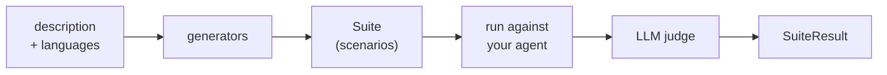

A **scan** writes test cases for your agent and runs them. You describe your agent in a sentence, and the scan produces hostile conversations designed to make it misbehave, sends them to your agent, and reports which ones worked. This is **red teaming**: attacking your own system on purpose to find out how it breaks before someone else does.

Run one when you have an agent that talks to users and you do not yet know what it will do under pressure. A first scan against a bank's customer-support bot typically finds that it gives investment advice it should refuse, or that it follows instructions hidden inside a pasted email.

This page explains what happens inside that one function call, so you can tell why a scan found what it found, and why it sometimes finds the wrong thing. Read [Your First Scan](/oss/solutions/tutorials/your-first-scan) first if you have not run one yet.

## What a scan is made of

Four pieces do the work:

- **Description**: the sentence you write about your agent. Everything else is derived from it.
- **Generator**: code that turns that description into concrete test cases. Some generators ask an LLM to invent attacks, some replay a fixed attack dataset.
- **Scenario**: one test case. A starting message (or a short conversation), plus the checks that decide whether the agent's reply was acceptable. A **suite** is the collection of scenarios the generators produced.
- **Judge**: an LLM that reads each finished conversation and decides pass or fail. There is no string matching involved, and no ground-truth answer.

## The pipeline

`vulnerability_scan` runs the whole chain in one call. `generate_suite` stops after the suite so you can inspect, edit, or save it before running anything.

Generation is therefore separate from execution. A suite is data: once generated it can be serialized, committed, replayed against a different agent, or run a thousand times without another generation call. That is what [running the scan in CI](/oss/solutions/how-to/scan-in-ci) relies on.

## Generators

A scenario generator turns your description into concrete **adversarial** scenarios, meaning messages written to make the agent fail rather than to use it normally. The scan ships three kinds, and they differ in where the attack comes from:

| Kind | Where scenarios come from | Examples |
| --- | --- | --- |
| **LLM-driven** | An LLM invents attacks tailored to *your* description | `AdversarialScenarioGenerator`, `GOATAttackScenarioGenerator`, `CrescendoAttackScenarioGenerator` |
| **Dataset-backed** | A fixed, bundled attack corpus, annotated with your description | `PromptInjectionScenarioGenerator`, `HuggingFaceDatasetScenarioGenerator` |
| **Knowledge-base** | Your own documents, used to check answers against them | quality-scan generators |

Knowledge-base generators test **grounding**: whether the agent's answer is supported by the documents you supplied, rather than invented. An unsupported answer is a [hallucination](/start/glossary/business/hallucination).

This is why the `description` matters so much. Dataset-backed generators produce the same prompts regardless of what your agent does. LLM-driven ones only produce *relevant* attacks if you tell them what the agent is for and what it must refuse. A vague description ("a chatbot") yields generic attacks and a shallow report. "A customer-support bot for a retail bank that answers questions about accounts and cards, and must never give investment advice" yields attacks worth reading.

`vulnerability_scan` and `quality_scan` are each a **registry**, a preselected set of generators, plus a run. Pass your own list to `generate_suite` when you want a different mix. The full catalog is in the [generators reference](/oss/solutions/reference/generators).

### The attack families you will see

These are the families that show up most often in a vulnerability report, mapped to the [OWASP LLM Top 10 ↗](https://genai.owasp.org/llm-top-10/):

| Attack | What it does | Vulnerability category |
| --- | --- | --- |
| **[Prompt injection](/start/glossary/security/injection)** | Hides an injected instruction inside realistic content, such as a pasted email or a support ticket, to see whether the agent obeys it instead of its original instructions. | Prompt Injection (OWASP LLM01) |
| **Single-turn adversarial** | Sends direct requests that test for [harmful](/start/glossary/security/harmful-content) or unauthorized content: [stereotypes and discrimination](/start/glossary/security/stereotypes), illegal activities, CBRN material, copyright, misinformation, and unqualified financial, medical, or legal advice. | Harmful Content Generation, Misguidance & Unauthorized Advice |
| **GOAT multi-turn jailbreak** | A **jailbreak** is a conversation that talks the agent out of its own rules. GOAT uses an attacker LLM that adapts over several turns, chaining refusal suppression, persona modification, and hypothetical framing to push the agent toward objectives it should refuse. | Harmful Content Generation |

A vulnerability scan also runs Crescendo multi-turn attacks, GCG suffix injections, and two Hugging Face attack datasets. The [generators reference](/oss/solutions/reference/generators) is the source of truth, and the [vulnerability categories catalog](/hub/ui/scan/vulnerability-categories) has the complete category list.

### The scenario budget

`max_scenarios` defaults to `None`, which means every generator runs its own default budget. That is how a first scan quietly becomes a few hundred LLM calls. When you set it, it is a **total** across all generators, distributed by a multinomial draw rather than split evenly. So you can get fewer scenarios than you asked for, because individual generators have their own internal caps, and a generator that draws a zero budget is skipped entirely, leaving some threat types uncovered on that run. Raise `max_scenarios` when you want breadth; keep it small only while iterating.

`seed` (default `42`) makes the draw and the generation reproducible. Change it and you get a different set of scenarios, so two runs with different seeds are not comparable.

## Target modes

`target_mode` declares what kind of conversation your agent can hold, and it silently changes which attacks exist. **Single-turn** means one message and one reply, with no memory of what came before. **Multi-turn** means a back-and-forth conversation the attacker can steer.

- **`"multiturn"`** (default): the attacker gets several turns and can adapt. This is where GOAT and Crescendo live. They open benign and escalate, which is how real jailbreaks work.
- **`"singleturn"`**: every scenario is one message. Multi-turn-only generators log a warning and return **nothing**, and the generators that do run have their turn budget capped to 1.

`target_mode="singleturn"` therefore removes a whole class of vulnerability from the report. Use it only when your agent genuinely cannot hold a conversation.

Multi-turn mode calls your agent once per turn with only the new message, so your wrapper has to handle continuity itself, either by carrying a thread id on a `Trace` subclass or by rebuilding the history from `trace.interactions`. Both patterns are in [Wrap your agent](/oss/solutions/how-to/wrap-your-agent).

## Threat types vs. components

Two orthogonal labels show up in reports, and conflating them causes confusion:

- A **threat type** is *what kind of failure* this is: `prompt-injection`, `harmful-content-generation`, `misguidance-and-unauthorized-advice`. It is a tag on the scenario, which is why `group_by="threat-type"` (the default) produces a report organized by risk category, and why scenarios also carry OWASP tags like `owasp:llm-top-10-2025:LLM01`.
- A **component** is *which part of your system* was exercised: the generator that produced the scenario, and the checks that judged it.

One generator can emit several threat types (`AdversarialScenarioGenerator` covers most of the harmful-content categories plus unauthorized advice), and one threat type can come from several generators (prompt injection arrives from both the dataset and the LLM-driven attacks). Grouping by threat type answers *"how exposed am I?"*. Looking at generators answers *"what did we actually try?"*. You need both: a clean report for a threat type may mean the agent is robust, or it may mean the budget allocated no scenarios there.

## The judge is an LLM

Every verdict in the report is produced by a language model reading a conversation and deciding whether it violated a rule. **LLM-as-a-judge** is the standard technique for grading free-text answers, and it is imperfect. Read this section before you act on a report.

- **The judge is wrong in both directions.** It flags replies that merely *discuss* a topic without helping with it, and it misses harm that is phrased indirectly. A failure is evidence that a conversation is worth reading, not proof of a vulnerability. Open the conversation before you file a bug, and open it again before you dismiss one.
- **A scan that finds nothing does not mean the agent is safe.** It means these generated scenarios did not break it. A different seed, a longer budget, or a real attacker will try things this run did not.
- **The scan is not exhaustive, and it is not a compliance certificate or an audit.** It samples an attack space that has no fixed size.
- **Results move between runs.** The same scenario against the same agent can pass once and fail the next time, and a new run with a different seed produces different scenarios entirely. If you want two runs to be comparable, save the suite and replay that exact file with the same seed. Otherwise a pass-rate change tells you nothing about whether your fix worked.
- **A pass rate is a sample, not a risk measurement.** 95% means 95% of the scenarios this run happened to generate. It does not mean your agent is 95% safe.
- **The judge model matters.** A weaker judge is cheaper but noisier, and it is the cost you pay on every replay. Generation happens once; judging happens every run.
- **Your data reaches an LLM provider.** The generator and judge models see your agent's description and everything it replies. They never see anything you do not pass to the agent, but if your agent returns customer records or internal documents, those go to the provider you configured. Choose it accordingly.

The scan is a discovery tool. Its job is to point you at conversations worth reading.

## Scan and Checks are the same runtime

`giskard-scan` is built on top of [Giskard Checks](/oss/checks). A scan returns an ordinary `Suite` of ordinary `Scenario` objects containing ordinary `Check` objects. Nothing about the result is special:

- `suite.run(target=...)` is the same method you call on a hand-written suite
- `SuiteResult` exposes the same `pass_rate`, `failures_and_errors`, and `to_junit_xml`
- You can append your own scenarios to a generated suite, or reuse a scan's checks in your own

The split is about **who writes the tests**. The scan writes them for you from a description, which is how you find failures you did not think to look for. Checks is how you write them yourself, which is how you lock in the behavior you already know you need. Findings flow one way: a vulnerability the scan discovers becomes a check you keep forever.

## Next Steps

- [Your First Scan](/oss/solutions/tutorials/your-first-scan) to run the pipeline end to end
- [Generators reference](/oss/solutions/reference/generators) for the full catalog with every parameter
- [When to use which check](/oss/checks/explanation/when-to-use-which-check) for the same judge tradeoffs from the Checks side
